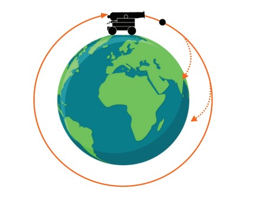

# ATIVIDADE 03 - Aplicação interativa com gráficos 3D, iluminação e texturização

**Nome**: Guilherme Ferreira Galdino
**RA**: 11201811063


## Descrição

### Canhão de Newton

O canhão de Newton, é um experimento mental imaginado por Isaac Newton para mostrar que sua lei da gravitação era universal. Disparando o canhão horizontalmente do alto de uma montanha, a bala cairia na Terra em virtude da força da gravidade. Com uma maior velocidade inicial, a bala iria mais longe antes de retornar à Terra. Com a velocidade certa, o projétil daria uma volta completa em torno da Terra, sempre “caindo” sob ação da gravidade, mas nunca alcançando a Terra. Newton concluiu que esse movimento orbital seria da mesma natureza do movimento da Lua em torno da Terra.



## Implementação

O diretório do projeto ```abcg/examples/orbitas``` possui a seguinte estrutura:

```
orbitas
│   camera.cpp
|   camera.hpp
|   CMakeLists.txt
|   main.cpp
|   sphere.cpp
|   sphere.hpp
|   window.cpp
|   window.hpp
│
└───assets
    └─── maps
    └─── shaders
    │   cannon.mtl
    │   cannon.obj
    │   cannonball.obj
    │   earth.mtl
    └   earth.boj


```

* ```camera.cpp``` e ```camera.hpp```: Código fonte responsável pela câmera.

* ```model.cpp``` e ```model.hpp```: Código para gerar o VBO, EBO e VAO para os objetos e renderizar cada uma de acordo com o model matrix e texture.

* ```window.cpp``` e ```window.hpp```: Código responsável pela atualizações na tela e animações.

* ```main.cpp```: Responsável pela execução da aplicação e tratamento de erro.

O subdiretório ```assets``` contém os arquivos obj, mtl, shaders e maps para os objetos da aplicação.


### Código

Os shaders utilizados foram a iluminação blinn-phong com sombreamento phong e o skybox para o mapeamento do ambiente.

A atualização da posição dos projéteis é calculado de acordo com a fórmula da gravitação de newton


**F = G * (m1 * m2) / r^2**


Onde:
- F é a força gravitacional entre duas massas,
- G é a constante gravitacional universal,
- m1 e m2 são as massas dos objetos,
- r é a distância entre os centros das massas.

O código que aplica a fórmula está presente em ```model.cpp```:

```cpp

void Model::updateSatellite(float deltaTime) {
  double GRAVITATIONAL_CONST = 0.0005;

  double xPosition = position.x;
  double yPosition = position.y;
  double xPlanet = satellite_of->position.x;
  double yPlanet = satellite_of->position.y;
  double planetMass = satellite_of->mass;

  double dist = glm::length(glm::distance(position, satellite_of->position));

  double massProduct = mass * planetMass;
  double distProduct = dist * dist;

  double gravitationalForce = GRAVITATIONAL_CONST * massProduct / distProduct;

  double cos = (xPlanet - position.x) / dist;
  double sin = (yPlanet - position.y) / dist;
  
  glm::vec3 forca{0.0f};
  forca.x = gravitationalForce * cos;
  forca.y = gravitationalForce * sin;

  m_acceleration.x = forca.x / mass;
  m_acceleration.y = forca.y / mass;

  m_speed.x = m_speed.x + m_acceleration.x;
  m_speed.y = m_speed.y + m_acceleration.y;

  position += m_speed * deltaTime;

  double newDist = glm::length(glm::distance(position, satellite_of->position));
  if (newDist < satellite_of->radius + radius) {
    position.x = xPosition;
    position.y = yPosition;

    m_speed.x = 0;
    m_speed.y = 0;
  }
}
```

Na função é calculado o valor absoluto da força que é decomposta em um vetor nos eixos x e y. Na sequência é calculado a aceleração da gravidade aumentando a velocidade do projetil.

Caso a distância do projetil e o planeta seja menor do que as distâncias dos seus centros de massa, então o projetil retorna para a posição anterior e sua velocidade é zerada.


Em ```window.hpp``` é definido os modelos e os programas dos shaders utilizados para renderizar os objetos. 

```cpp

class Window : public abcg::OpenGLWindow {
protected:
  void onEvent(SDL_Event const &event) override;
  void onCreate() override;
  void onUpdate() override;
  void onPaint() override;
  void onPaintUI() override;
  void onResize(glm::ivec2 const &size) override;
  void onDestroy() override;
  Model createSphere(float horizontalSpeed = 0.0f);

private:
  std::default_random_engine m_randomEngine;
  glm::ivec2 m_viewportSize{};

  Model m_planet;
  Model m_cannon_model;
  Model m_satellite_model;
  Skybox m_skybox;

  Camera m_camera;
  float m_dollySpeed{};
  float m_truckSpeed{};
  float m_panSpeed{};
  float m_verticalSpeed{};

  float m_horizontal_speed{0.0f};
  float horizontal_speed{0.0f};
  int m_satellites_total{0};

  std::vector<Model> m_satellites;
  
  GLuint m_program{};
  GLuint m_skybox_program{};

  // Mapping mode
  // 0: triplanar; 1: cylindrical; 2: spherical; 3: from mesh
  int m_mappingMode{};

  // Light and material properties
  glm::vec4 m_lightDir{-1.0f, -1.0f, -1.0f, 0.0f};
  glm::vec4 m_Ia{1.0f};
  glm::vec4 m_Id{1.0f};
  glm::vec4 m_Is{1.0f};
};

```

*  `m_planet`, `m_cannon_model`, `m_satellite_model`, `m_skybox`: são os modelos utilizados para o planeta, canhão, projetil e o ambiente, respectivamente;

* `std::vector<Model> m_satellites`: o vetor dos projeteis que são adicionados quando usuário interage com a aplicação;

*  `m_program`, `m_skybox_program`: são programas shaders para os objetos e o ambiente, respectivamente;

* `void onEvent(SDL_Event const &event)` e `horizontal_speed`: evento do teclado utilizado para quando o usuario clicar ENTER ser disparado um novo projetil com a velocidade atual mostrado no widget de controle de movimento;


## BUGS 

A maior dificuldade do projeto foi aplicar a fórmula da gravitação no modelo 3D. Mesmo após muitas tentativas existem alguns bugs:

* Velocidade dos projeteis mudam conforme o zoom da câmera. A mesma velocidade pode entrar em órbita em uma visão, mas em uma visão mais distante não.

* Semelhante ao anterior, a mesma velocidade tem comportamento diferente dependendo do ambiente que está rodando. Em aplicação desktop, os valores para entrar em órbita são diferentes para a aplicação web.


